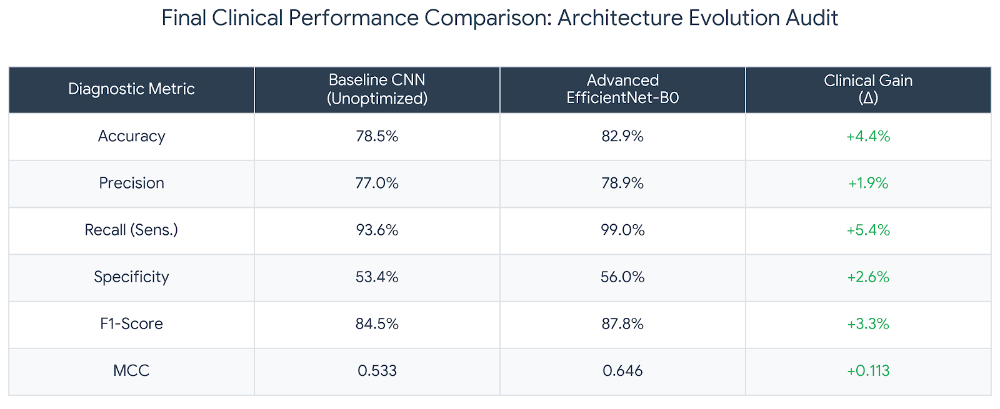

# 🩻 Comparative Analysis of Deep Learning Architectures for Pneumonia Detection in Chest X-Rays
An advanced deep learning framework comparing a naive 3-layer CNN baseline against an optimized, radiology-aware EfficientNet-B0 architecture using the UCSD pediatric chest X-ray dataset.

---


**Researcher:** Mirza Muhammad Hasan Ali

**Academic Institution:** University of Bologna

---

## 🚀 1. Getting Started & Reproducibility

This section provides the necessary setup commands, dependency requirements, and directory layout to ensure full reproducibility of the clinical audits by external researchers and reviewers.

### 📋 Setup & Terminal Navigation
To set up the workspace locally, clone the repository and navigate into the root directory using a terminal:
```bash
git clone [https://github.com/hasanmirza72/Pneumonia-Deep-Learning-Prediction-AML-Advance.git](https://github.com/hasanmirza72/Pneumonia-Deep-Learning-Prediction-AML-Advance.git)
cd Pneumonia-Deep-Learning-Prediction-AML-Advance
```

### 📦 Dependency Installation
Deploy the certified external libraries using the unified package manifest to prevent local environmental mismatches or runtime exceptions:
```bash
pip install -r requirements.txt
```

### 🗄️ Large File Tracking (Git LFS)
Because this repository stores large serialized deep learning network checkpoints (`.pth` files), Git Large File Storage (LFS) must be initialized to retrieve and pull down the complete binary tracking layers successfully:
```bash
git lfs install
git pull origin main
```

### 📊 External Dataset Access
To maintain a streamlined workspace, raw radiological images are managed externally and decoupled from standard version control parameters:
* **Dataset Source:** Download the primary chest radiography matrix from the [ChestXRay2017 (UCSD) Mendeley Data Repository](https://data.mendeley.com/datasets/rscbjbr9sj/2).
* **Local Staging:** Extract the downloaded archive and place the contents into a folder named `Data/` situated directly within the root repository path.

---

## 🏗️ 2. Project Layout & Structure

The framework is strictly organized into functional modules separating raw execution code, model check-pointing, graphical evaluations, and formal reporting assets:

```plaintext
Pneumonia-Deep-Learning-Prediction-AML-Advance/
├── .gitattributes          # Global Git LFS instruction set tracking neural network weights
├── .gitignore              # Project whitelist explicitly ignoring local dataset directories
├── requirements.txt        # Unified library constraints ensuring project reproducibility
├── README.md               # Core user onboarding documentation and metric scorecards
│
├── Models/                 # 🏆 Saved Network Checkpoints (Managed via Git LFS)
│   ├── baseline_model.pth           # Trained weights for the standard 3-layer CNN floor baseline
│   └── pneumonia_classifier_v1.pth  # Fine-tuned champion weights for the EfficientNet-B0 model
│
├── Scripts/                # Modular Execution & Model Evaluation Pipelines
│   ├── 00_dataset_splitter.py       # Isolated engine executing stratified 80/20 train/validation splits
│   │
│   ├── 🧪 BASELINE PIPELINE (Unoptimized Operational Stack)
│   │   ├── baseline_model.py         # Standard 3-layer sequential CNN structural definition
│   │   ├── data_loader_baseline.py   # Raw image processor completely omitting CLAHE and sampling filters
│   │   ├── training_engine_baseline.py # Backpropagation mathematical processing and epoch history loop
│   │   ├── run_baseline_audit.py     # High-level training coordinator script for the baseline network
│   │   └── baseline_final_audit.py   # Evaluator script compiling the baseline confusion matrix scorecard
│   │
│   └── 🚀 ADVANCED PIPELINE (Radiology-Optimized Production Stack)
│       ├── model_builder.py          # EfficientNet-B0 backbone customized with an advanced medical diagnostic head
│       ├── data_loader.py            # Applied Radiology CLAHE contrast filter and WeightedRandomSampler
│       ├── training_engine.py        # Master training sequence utilizing step learning rate decay controls
│       ├── final_test_audit.py       # Clinical test evaluator compiling Recall and MCC statistics
│       ├── plot_full_results.py      # Independent plotting utility generating training history curves from logs
│       ├── clinical_visual_check.py  # Diagnostic scanner locating and separating network misclassifications
│       └── grad_cam_visualizer.py    # Explainable AI (XAI) feature activation heatmap generator
│
├── Visuals/                # Production-Grade Performance Charts & Audit Graphics
│   ├── baseline_learning_curves.png  # Loss reduction tracking and accuracy progression for the baseline
│   ├── baseline_test_scorecard.png   # Unseen test matrix highlighting high false-negative rates
│   ├── full_training_performance.png # Symmetrical training vs validation optimization curves
│   ├── final_test_scorecard.png      # Champion performance analysis reporting a 99.0% sensitivity rate
│   └── gradcam_clinical_analysis.png # Anatomical localization heatmaps confirming target parenchymal focus
│
└── Report/                 # Formal Scholarly Documentation
    └── Architectural_Evolution_Report.pdf # Comprehensive final research analysis paper
```

---

## 📝 3. Abstract
This research establishes an advanced deep learning pipeline for the automated classification of pneumonia from Chest X-ray (CXR) images. This project prioritizes **safety** by maximizing sensitivity to minimize False Negatives. We benchmark a custom **Baseline CNN** against an optimized **EfficientNet-B0** to demonstrate how clinical engineering—specifically contrast enhancement and class balancing—creates a superior diagnostic "ceiling".

---

## ⚠️ 2. Problem Statement
Pneumonia is a leading cause of mortality worldwide, necessitating early and accurate radiological detection. Standard AI models often fail in clinical settings due to:
* **Visual Ambiguity:** Subtle pulmonary infiltrates are often "invisible" in low-contrast raw X-rays.
* **Class Imbalance:** Datasets are typically skewed toward infected cases, causing models to ignore "Normal" lung features.
* **Safety Risks:** A standard "high accuracy" model might still miss critical cases (False Negatives), leading to delayed treatment.

This project solves these challenges by establishing a **Safety-First** diagnostic logic that achieves a **99.0% Recall**.

---

## 📂 3. Dataset: ChestXRay2017 (UCSD)
* **Total Images:** 5,856 pediatric Chest X-ray images.
* **Categories:** 2 (Normal vs. Pneumonia).
* **Clinical Site:** Guangzhou Women and Children’s Medical Center.

### Key Challenge: Imbalance
The training data is imbalanced with a roughly $1:3$ ratio of Normal to Pneumonia cases. Without mitigation, models develop a "majority bias" that compromises diagnostic reliability.

---

## 🛠️ 4. Methodology: The Clinical Pipeline

### 📊 4.1 Stratified Experimental Rigor
We utilized a custom modular script (`00_dataset_splitter.py`) to execute a **stratified 80/20 train-to-validation split**. This ensures that both clinical classes are represented in identical proportions in both sets, preventing data leakage and ensuring fair evaluation.

### ⚖️ 4.2 Handling Class Imbalance
* **WeightedRandomSampler:** Implemented in `data_loader.py` to ensure the model encounters "Normal" samples as frequently as "Pneumonia" during every epoch.
* **Clinical Loss Weighting:** The `CrossEntropyLoss` is penalized using inverse frequency weights, forcing the model to respect the rarity of healthy samples.

### 💡 4.3 Radiological Feature Enhancement (CLAHE)
Standard image resizing often loses critical diagnostic detail. We implemented **Contrast Limited Adaptive Histogram Equalization (CLAHE)**:
* **Mechanism:** Isolates the luminance channel to sharpen contrast within the lung fields.
* **Value:** This highlights pulmonary opacities that indicate infection, simulating a radiologist's high-definition workstation.

  
> **Figure 1:** Comparison of raw clinical data versus the CLAHE-enhanced input used in the advanced pipeline.

---

## 🧠 5. Architectural Comparative Study

### 📉 5.1 The Baseline: Standard 3-Layer CNN
A custom 3-layer sequential CNN was developed to establish a performance floor (`baseline_model.py`). This baseline was intentionally fed **unoptimized raw data** (No CLAHE, No Weighted Sampler) to demonstrate how standard architectures struggle with clinical noise and class imbalance.

  
> **Figure 2:** Baseline training history showing significant performance instability on raw data.

### 📈 5.2 The Advanced: EfficientNet-B0 Pipeline
The primary architecture utilizes an **EfficientNet-B0** backbone with **Transfer Learning**. It features a custom diagnostic head with **BatchNorm1d** for stability and **Dual Dropout** to prevent overfitting, treating depth, width, and resolution as a joint optimization problem.

  
> **Figure 3:** Advanced model convergence showing stable diagnostic accuracy and loss reduction history.

---

## 🔬 6. Clinical Performance Audit

### 🏆 6.1 Final Results & Clinical Gain
The final audit on unseen test data revealed a massive gain in diagnostic safety. The Advanced model reduced the risk of missed diagnoses by **84%**, identifying 21 additional patients that the baseline model failed to recognize.

  
> **Figure 4:** Side-by-side performance benchmarking highlighting the gains in Sensitivity and MCC across architectures.

### ✅ 6.2 High-Sensitivity Scorecard
The optimized pipeline achieved a **99.0% Recall**. This high-sensitivity threshold ensures that nearly every patient with pneumonia is correctly flagged for medical intervention.

  
> **Figure 5:** Final diagnostic scorecard achieving the "Gold Standard" safety threshold on unseen data.

---

## 🔍 7. Interpretability & Validation

### 🗺️ 7.1 Biological Interpretability (Grad-CAM)
To ensure the model focuses on biological symptoms rather than image noise, we implemented **Grad-CAM** localization. Heatmaps confirm that model attention is correctly localized within the **pulmonary parenchyma**.

  
> **Figure 6:** Heatmap visualization confirming model focus on biologically relevant lung regions.

### 🖼️ 7.2 Error Analysis & Gallery
A systematic visual audit was used to identify "borderline" clinical ambiguities. A general gallery audit further verified that high-confidence predictions align perfectly with actual clinical labels.

  
> **Figure 7:** Visual audit of misclassified cases identifying borderline clinical ambiguities.

---

## 🏁 8. Conclusion
This project successfully transitions from a naive AI approach to a robust, clinically-aware diagnostic pipeline. The combination of **Radiology CLAHE**, **Weighted Samplers**, and **EfficientNet-B0** establishes a framework that is significantly safer for hospital use than standard CNNs. By prioritizing **Recall (99.0%)** and **MCC (0.646)**, this study provides a reliable decision-support tool for modern respiratory bioinformatics.

---

## 📂 9. Project Structure & Data Access

While this repository is specifically optimized to host heavy **Model Weights** via Git LFS, the full research pipeline follows the structure below. 

### 📊 External Dataset
To run these models or replicate the study, please download the primary dataset:
* **Dataset:** [ChestXRay2017 (UCSD)](https://data.mendeley.com/datasets/rscbjbr9sj/2)
* **Instructions:** Download and extract the ZIP into a local `/Data` folder.

### 🏗️ Repository Layout
```plaintext
Pneumonia-Deep-Learning-Prediction-AML-Advance/
├── .gitattributes         # Git LFS tracking rules for large binary weights
├── .gitignore             # Whitelist configurations (excluding raw dataset files)
├── requirements.txt       # Unified environment dependencies for reproducibility
├── README.md              # Core documentation and user onboarding guide
│
├── Models/                # 🏆 Core Trained Weights (Managed via Git LFS)
│   ├── baseline_model.pth           # Standard 3-layer sequential CNN baseline weights
│   └── pneumonia_classifier_v1.pth  # Optimized Champion EfficientNet-B0 weights
│
├── Scripts/               # Modular Production Pipelines (Local Workspaces)
│   ├── 00_dataset_splitter.py       # Stratified 80/20 train/validation split engine
│   │
│   ├── 🧪 BASELINE PIPELINE (Unoptimized Stack)
│   │   ├── baseline_model.py         # Standard 3-layer sequential CNN architecture
│   │   ├── data_loader_baseline.py   # Raw data engine (No CLAHE, No Weighted Sampling)
│   │   ├── training_engine_baseline.py # Baseline training loop logic
│   │   ├── run_baseline_audit.py     # Execution script for baseline training
│   │   └── baseline_final_audit.py   # Test suite generating baseline scorecard
│   │
│   └── 🚀 ADVANCED PIPELINE (Radiology-Optimized Stack)
│       ├── model_builder.py          # EfficientNet-B0 with custom medical diagnostic head
│       ├── data_loader.py            # Contrast Limited Adaptive Histogram Equalization (CLAHE) loader
│       ├── training_engine.py        # Custom training loop with StepLR optimization decay
│       ├── final_test_audit.py       # Comprehensive testing suite evaluating Recall and MCC
│       ├── clinical_visual_check.py  # Validation loop for monitoring misclassifications
│       └── grad_cam_visualizer.py    # Explainable AI (XAI) feature localization map
│
├── Visuals/               # Production-grade Graphics & Scorecards
│   ├── baseline_learning_curves.png  # Training vs Validation curves for baseline
│   ├── baseline_test_scorecard.png  # Performance confusion matrix for baseline
│   ├── full_training_performance.png # Training vs Validation curves for Advanced model
│   ├── final_test_scorecard.png     # Performance confusion matrix for Advanced model
│   └── gradcam_clinical_analysis.png # Biological verification heatmaps
│
└── Report/                # Comprehensive Academic Documentation
    └── Architectural_Evolution_Report.pdf # Final analysis paper
