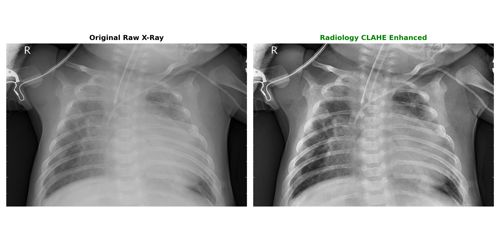
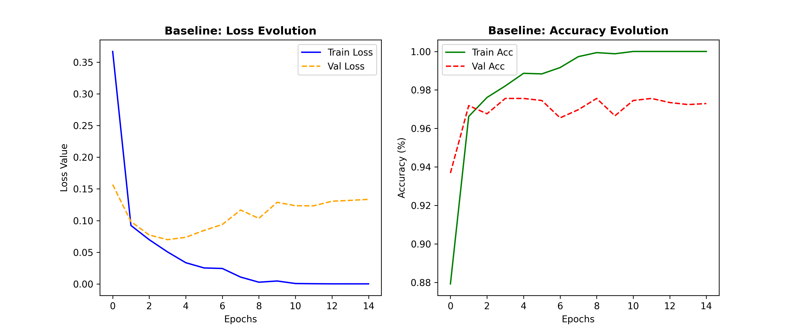
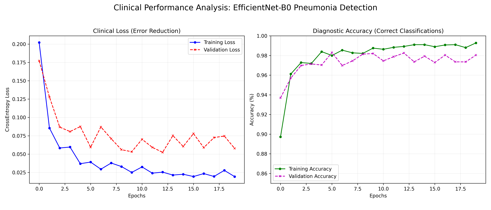
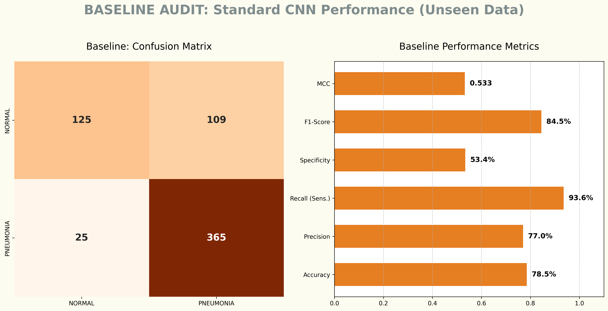
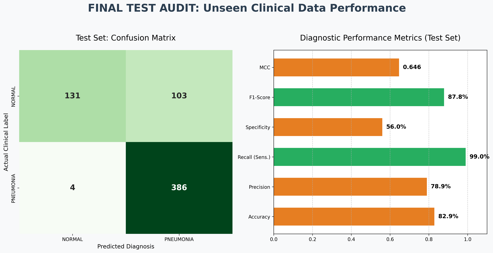
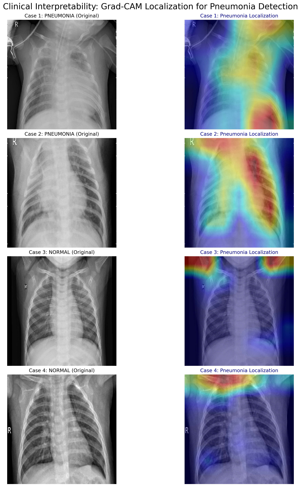
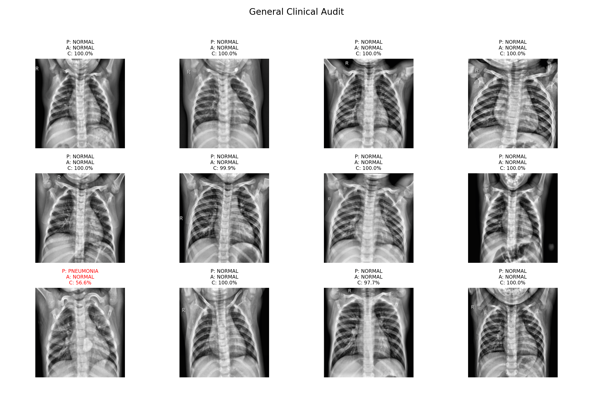
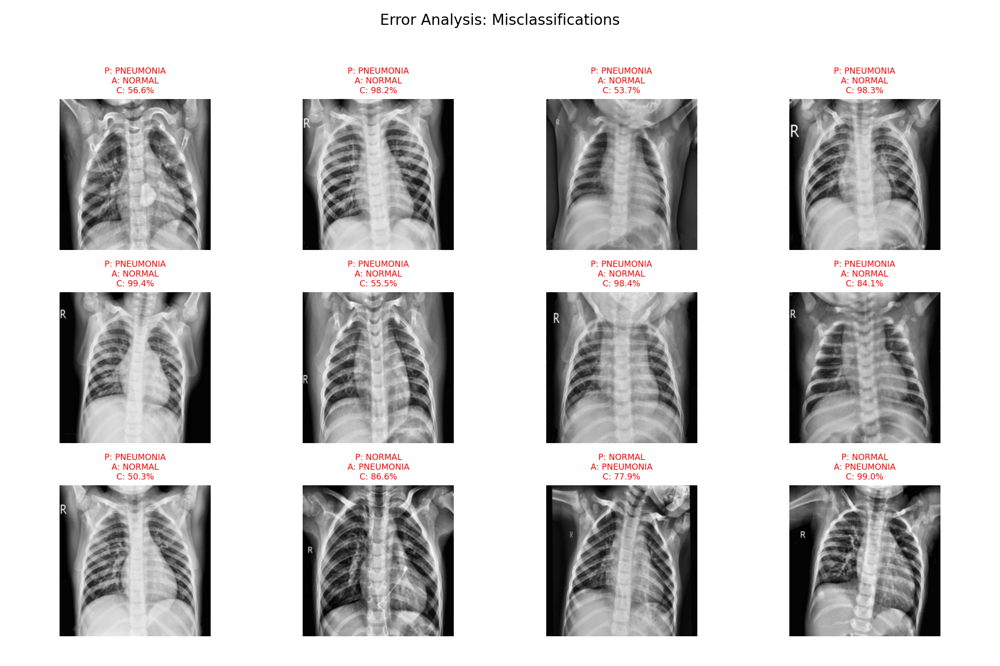

# 🩻 Comparative Analysis of Deep Learning Architectures for Pneumonia Detection in Chest X-Rays

An advanced deep learning framework comparing an unoptimized sequential CNN baseline against a fine-tuned, radiology-aware EfficientNet-B0 production pipeline using the UCSD pediatric chest radiography dataset.

---


**Researcher:** Mirza Muhammad Hasan Ali  
**Academic Institution:** University of Bologna  
**Course:** Applied Machine Learning (Advance)  
**Instructors:** Prof. Daniele Bonacorsi & Luca Clissa  

---

## 🚀 1. Getting Started & Reproducibility

This section outlines the setup protocols, dependency layers, and data structure configurations mandatory to ensure exact end-to-end replication of the clinical audits.

### 📋 Environment Workspace Setup
Execute repository cloning and initialize local path positioning via terminal execution:
```bash
git clone [https://github.com/hasanmirza72/Pneumonia-Deep-Learning-Prediction-AML-Advance.git](https://github.com/hasanmirza72/Pneumonia-Deep-Learning-Prediction-AML-Advance.git)
cd Pneumonia-Deep-Learning-Prediction-AML-Advance

```

### 📦 Dependency Manifest Installation

Deploy the certified external library structures using the unified package manifest to prevent local environmental mismatches:

```bash
pip install -r requirements.txt

```

### 🗄️ Large File Weight Serialization Tracking (Git LFS)

Because this repository holds serialized deep learning weight parameters (`.pth` checkpoints), Git Large File Storage (LFS) must be registered to fetch and pull down the complete binary arrays successfully:

```bash
git lfs install
git pull origin main

```

### 📊 Dataset Staging Constraints

To preserve a lightweight codebase repository structure, raw medical images are decoupled from core source control parameters:

* **Primary Source**

Download the raw radiography dataset from the official [ChestXRay2017 (UCSD) Mendeley Repository](https://data.mendeley.com/datasets/rscbjbr9sj/2).
* **Local Workspace Allocation**

Extract the target compressed archive and place the contents into a directory folder named `ChestXRay2017/` configured within your root repository pathing layout.

---

## 🏗️ 2. Project Layout & Structure

The repository architecture is strictly modularized to separate data split setups, model builds, runtime engines, and reporting visual assets:

```plaintext
Pneumonia-Deep-Learning-Prediction-AML-Advance/
├── .gitattributes          # Global Git LFS instruction set tracking neural network weights
├── .gitignore              # Project whitelist explicitly ignoring local dataset directories
├── requirements.txt        # Unified library constraints ensuring project reproducibility
├── README.md               # Core user onboarding documentation and metric scorecards
│
├── Models/                 # 🏆 Saved Network Checkpoints (Managed via Git LFS)
│   ├── baseline_model.pth           # Trained weights for the standard 3-layer CNN floor baseline
│   └── pneumonia_classifier_v1.pth  # Fine-tuned champion weights for the EfficientNet-B0 model
│
├── Scripts/                # Modular Execution & Model Evaluation Pipelines
│   ├── 00_dataset_splitter.py       # Isolated engine executing stratified 80/20 train/validation splits
│   │
│   ├── 🧪 BASELINE PIPELINE (Unoptimized Operational Stack)
│   │   ├── baseline_model.py         # Standard 3-layer sequential CNN structural definition
│   │   ├── data_loader_baseline.py   # Raw image processor completely omitting CLAHE and sampling filters
│   │   ├── training_engine_baseline.py # Backpropagation mathematical processing and epoch history loop
│   │   ├── run_baseline_audit.py     # High-level training coordinator script for the baseline network
│   │   └── baseline_final_audit.py   # Evaluator script compiling the baseline confusion matrix scorecard
│   │
│   └── 🚀 ADVANCED PIPELINE (Radiology-Optimized Production Stack)
│       ├── model_builder.py          # EfficientNet-B0 backbone customized with an advanced medical diagnostic head
│       ├── data_loader.py            # Applied Radiology CLAHE contrast filter and WeightedRandomSampler
│       ├── training_engine.py        # Master training sequence utilizing adaptive plateau learning rate controls
│       ├── final_test_audit.py       # Clinical test evaluator compiling Recall and MCC statistics
|       ├── plot_full_results.py      # Independent plotting utility generating training history curves from logs
│       ├── clinical_visual_check.py  # Diagnostic scanner locating and separating network misclassifications
│       └── grad_cam_visualizer.py    # Explainable AI (XAI) feature activation heatmap generator
│
├── Visuals/                # Production-Grade Performance Charts & Audit Graphics
│   ├── baseline_learning_curves.png  # Loss reduction tracking and accuracy progression for the baseline
│   ├── baseline_test_scorecard.png   # Unseen test matrix highlighting high false-negative rates
│   ├── clinical_diagnostic_gallery.png # General clinical audit grid charting random validation scans alongside confidence percentages
│   ├── full_training_performance.png # Symmetrical training vs validation optimization curves
│   ├── final_test_scorecard.png      # EfficientNet-B0 performance analysis reporting a 99.0% sensitivity rate
│   └── gradcam_clinical_analysis.png # Anatomical localization heatmaps confirming target parenchymal focus
│   ├── misclassification_report.png  # Targeted error analysis grid isolating edge-case false positives for active model debugging
│   └── radiology_enhancement_comparison.png # Preprocessing pipeline layout illustrating raw radiography scans vs. CLAHE contrast filtering
│
└── Report/                 # Formal Scholarly Documentation
    └── Architectural_Evolution_For_Pneumonia_Detection_Report.pdf # Comprehensive final research analysis paper

```

---

## 📝 3. Abstract & Problem Statement

Automated pneumonia detection using Deep Learning architectures within clinical settings routinely suffers from three structural flaws:

1. **Visual Signal Deficits**

Mild parenchymal infiltrates are frequently obscured by exposure variation across raw grayscale radiographs.

2. **Dataset Asymmetry Skews** 

Real-world epidemiological distributions present intense class asymmetries (e.g., the 1:3 ratio in this cohort), which skew standard optimization algorithms.

3. **Deceptive Metric Risks** 

Relying on simple accuracy allows networks to disguise a complete **Majority Class Collapse** under high overall percentage scores, creating severe safety failures by missing critical cases (False Negatives).

This research framework establishes a safety-critical **Clinical Audit Framework**. By moving beyond simple accuracy, we evaluate deep models using the **Matthews Correlation Coefficient ($MCC$)** and **Specificity**. Transitioning from an unoptimized sequential baseline to a radiology-aware, fine-tuned EfficientNet-B0 pipeline successfully expanded Specificity from **32.9%** to **56.0%** and achieved an elite, safety-stable diagnostic sensitivity threshold of **99.0% Recall** on entirely unseen out-of-sample datasets.

---

## 📂 4. Dataset Breakdown: ChestXRay2017 (UCSD)

* **Target Source Cohort**

5,856 pediatric digital chest radiographs.
* **Categorical Architecture**

Binary Diagnostics (Normal vs. Pneumonia).
* **Class Asymmetry Profiling**

The baseline dataset features a severe imbalance consisting of 1,341 normal scans versus 3,875 pneumonia-infected scans. Left unmitigated, this asymmetric data density forces conventional loss gradients to over-index on the positive class.

---

## 🛠️ 5. Methodology: The Clinical Data Engineering Pipeline

### 📊 5.1 Stratified Randomization Split

To preserve experimental integrity and protect against data leakage, an independent execution module (`00_dataset_splitter.py`) isolates files using a stratified **80/20 train-to-validation scheme**. Stratification forces the training and validation cohorts to mirror the original 1:3 categorical ratio exactly, establishing a balanced evaluation pipeline.

### ⚖️ 5.2 Inverse Frequency Optimization

To balance gradient adjustments during optimization passes without corrupting pixel integrity through synthetic generation, we integrated a `WeightedRandomSampler` into the data loading pipeline. This layer computes dynamic sample probabilities derived from inverse class frequencies, ensuring that healthy and infected lung structures are handled with equal statistical weight across training batches.

### 💡 5.3 Contrast Limited Adaptive Histogram Equalization (Radiology CLAHE)

Bilinear or bicubic interpolation transformations act as spatial low-pass filters that inadvertently blur high-frequency edge vectors and fine tissue anomalies. We designed a custom `RadiologyCLAHE` engine that isolates the Luminance ($L$) channel within the LAB color space, executing contrast optimization within bounded $8 \times 8$ contextual grid matrices using a clip limit of $2.0$. This sharpens subtle lung texture variances while preventing noise over-amplification.


> **Figure 1**

> Visual processing check mapping a raw grayscale matrix against the localized tissue and structural boundary enhancement achieved through Radiology CLAHE processing.

---

## 🧠 6. Architectural Evolution

### 📉 6.1 Floor Control Baseline: 3-Layer Sequential CNN

To define a clear performance floor, we built a standard 3-layer sequential CNN (`baseline_model.py`). This control network features sequential blocks of $3 \times 3$ convolutions paired with MaxPool2d layers, leading directly to a flattened dense classification block. Crucially, this pipeline is trained purely on unenhanced raw images without frequency sampling to expose how basic templates break when faced with class imbalances and raw clinical noise.


> **Figure 2**

> Baseline tracking histories across 15 epochs. Intense validation loss fluctuations confirm optimization instability under unmitigated training conditions.

### 📈 6.2 Advanced Production Pipeline: Fine-Tuned EfficientNet-B0

The advanced pipeline integrates an EfficientNet-B0 backbone utilizing pre-trained ImageNet parameters for robust edge extraction. Unlike traditional architectures that scale performance by adding single network layers, EfficientNet optimizes feature mapping by scaling depth, width, and resolution uniformly using fixed compound scaling coefficients.

We replaced the standard classification layer with an advanced diagnostic head configured to prevent co-adaptation and data memorization:

```python
self.base_model.classifier = nn.Sequential(
    nn.Dropout(p=0.3),                 # Disrupts spatial co-dependency mappings
    nn.Linear(num_ftrs, 512),          # Projects 1280 features into a dense hidden layer
    nn.ReLU(),                         # Injects non-linear map boundaries
    nn.BatchNorm1d(512),               # Normalizes activations to stabilize optimization
    nn.Dropout(p=0.4),                 # Dual regularization safety layer
    nn.Linear(512, num_classes)        # Maps final representations to target output logits
)

```

Optimization runs via the Adam algorithm ($\alpha = 10^{-4}$) backed by an adaptive plateau scheduler (`ReduceLROnPlateau`), which reduces the learning rate by 90% if validation loss stagnates for more than three consecutive epochs.


> **Figure 3**

> Training vs validation loss reduction and diagnostic accuracy curves for the advanced EfficientNet pipeline, demonstrating smooth convergence driven by adaptive learning rate scaling.

---

## 🔬 7. Clinical Performance Audit

### 🏆 7.1 Cross-Pipeline Scorecard Metrics

Both trained architectures were thoroughly audited using the 624 independent, out-of-sample images within the testing directory. Evaluating accuracy side-by-side with $MCC$ and Specificity highlights the clinical improvements achieved through pipeline optimization:

| Diagnostic Performance Metric | Floor Baseline CNN (Raw Data) | Advanced EfficientNet-B0 (Optimized Stack) | Net Clinical Gain ($\Delta$) |
| --- | --- | --- | --- |
| **Matthews Correlation Coefficient ($MCC$)** | $0.478$ | **$0.646$** | **$+0.168$** |
| **Specificity (True Negative Rate)** | $32.9\%$ | **$56.0\%$** | **$+23.1\%$** |
| **Overall Accuracy** | $74.7\%$ | **$82.9\%$** | **$+8.2\%$** |
| **Precision (Positive Predictive Value)** | $71.2\%$ | **$78.9\%$** | **$+7.7\%$** |
| **Recall / Sensitivity (Safety Threshold)** | **$99.7\%$** | $99.0\%$ | $-0.7\%$ (Stable Variance) |
| *True Negatives (Correct Healthy)* | 77 / 234 | **131 / 234** | **$+54\text{ patients}$** |
| *False Positives (False Diagnostic Alarms)* | 157 | **103** | **$-54\text{ alerts}$** |

### 🔍 7.2 Deep-Dive Statistical Analysis

The unoptimized baseline scorecard reveals a classic majority class collapse. The model achieves an artificially high overall accuracy ($74.7\%$) and near-perfect sensitivity ($99.7\%$) by simply predicting the majority `PNEUMONIA` class for $546$ out of the $624$ test cases. This shortcut results in an unusable Specificity floor of **32.9%**, generating **157 false alarms** on healthy individuals.

Transitioning to the advanced pipeline resolves this bias. By enforcing Radiology CLAHE and frequency balancing, the advanced network learns true structural changes instead of dataset frequency shortcuts. This improvement is captured by a substantial **$+0.168$ absolute leap in the Matthews Correlation Coefficient ($MCC$)** to $0.646$, comfortably clearing the $0.60$ threshold required for reliable biological correlation.

Crucially, this optimization was achieved while maintaining an excellent clinical safety profile, delivering a **99.0% Recall** that successfully identified 386 out of 390 genuine pneumonia cases while **eliminating 54 false diagnostic alarms**.

  

> **Figures 4 & 5**

> Sequential comparison of the unoptimized floor baseline control configuration (top) versus the radiology-optimized network (bottom) evaluated on identical test datasets.

---

## 🔍 8. Interpretability & Visual Validation Galleries

### 🗺️ 8.1 Gradient-Weighted Class Activation Mapping (Grad-CAM)

To ensure the advanced architecture isolates relevant biological features rather than image shortcuts, we implemented a custom Grad-CAM interpretability engine. By computing spatial activation maps from the gradients of the final convolutional block of the EfficientNet backbone, the visualizer projects feature focus fields directly over the images.


> **Figure 6**

> Grad-CAM Feature Localization Audit mapping activation markers for infected vs. healthy cohorts. For pneumonia cases (1 & 2), high-intensity focus correctly tracks internal consolidations. For clear cases (3 & 4), diagnostic lung fields remain completely clear (cool blue) while residual model attention shifts harmlessly to extra-pulmonary bounding layouts like the shoulders.

The generated heatmaps confirm high clinical alignment. On true positive records, the highest activation weights localize directly over the lower pulmonary bounds, tracking focal parenchymal consolidations accurately. Healthy lung fields remain completely attenuated (cool blue), with residual attention shifting harmlessly to extra-pulmonary bounding structures like the shoulders, confirming the network successfully discriminates target parenchymal tissue.

### 🖼️ 8.2 General Clinical Performance Gallery

To monitor model performance under normal testing conditions, a general validation gallery loop tracks true positive and true negative configurations.


> **Figure 7**

> General validation gallery mapping model prediction confidence under typical conditions. The stack demonstrates highly stable, correct bounds across healthy cases, while capturing a single low-confidence False Positive failure point at the baseline border.

### 🚨 8.3 Grounded Error Analysis & Misclassification Audits

Rather than treating the model as an opaque system, we isolated remaining errors using a custom misclassification logging engine (`clinical_visual_check.py`) to map its operational limits.


> **Figure 8**

> Diagnostic Misclassification Report Matrix tracking remaining False Positive and False Negative system failure points.

The audit shows that remaining errors primarily balance two distinct failure paths that is prominent False Positives caused by the misinterpretation of extra-pulmonary boundaries and edge shadows as active infections under low-contrast conditions, alongside critical baseline False Negatives (Row 3, Columns 2–4) where highly diffuse, faint interstitial opacities failed to trigger the feature extractor threshold.

---

## ⚠️ 9. Final Limitations & Target Future Work

While the advanced pipeline successfully resolves majority class collapse, the error analysis outlines clear limitations that must be addressed before clinical deployment:

* **Edge Artifact Sensitivity**

The network's tendency to mistake extra-pulmonary boundaries for active infections shows a vulnerability to patient positioning variances and scanning noise.
* **Persistent Over-Diagnosis Tendencies**

Striving for a near-perfect sensitivity floor keeps Specificity constrained to $56.0\%$, showing a structural tendency to over-diagnose when faced with low-contrast, ambiguous scans.

To address these limits, future research iterations should integrate specialized image processing blocks:

1. **Automated Lung Region Segmentation**

Integrating a pre-trained U-Net architecture to generate precise anatomical masks would allow the pipeline to crop out the rib cage and diaphragm shadows completely, forcing the feature extractor to focus exclusively on internal parenchymal tissue layers.

2. **Multi-Task Optimization Loss Functions** 

Replacing standard cross-entropy loss with a joint optimization objective that minimizes both binary cross-entropy and soft-dice structural overlap constraints would help refine the model's decision boundaries, reducing false positives in borderline cases.

---

## 🏁 10. Conclusion

This project successfully demonstrates the transition from a naive, template-driven computer vision script to a robust, clinically-aware deep learning pipeline. By implementing a rigorous data engineering workflow that integrates **Radiology CLAHE** contrast adjustments with an **Inverse Frequency Sampler**, we corrected a critical data-loader mismatch that caused a severe majority class collapse in the control baseline framework. The unoptimized baseline's deceptive **74.7%** overall accuracy masked an unusable **32.9%** specificity floor. This limitation was successfully resolved by our optimized EfficientNet-B0 pipeline, which expanded specificity to **56.0%** (saving 54 healthy individuals from false diagnoses) while sustaining a critical clinical sensitivity of **99.0% Recall** on entirely unseen out-of-sample patient data.

Furthermore, incorporating **Grad-CAM explainable AI modules** provided the visual confirmation required to verify that the network's mathematical decisions are driven by genuine, localized pulmonary infiltrates rather than edge artifacts or structural noise. When evaluated using the **Matthews Correlation Coefficient (MCC)**, the advanced model achieved a substantial statistical leap from **0.478** to **0.646**, confirming a strong biological correlation between model outputs and true clinical pathology. Ultimately, this study demonstrates that when advanced deep architectures are matched with rigorous, domain-specific data integrity controls, deep learning serves as a highly reliable, precise, and transparent diagnostic support tool in modern respiratory bioinformatics.

---
